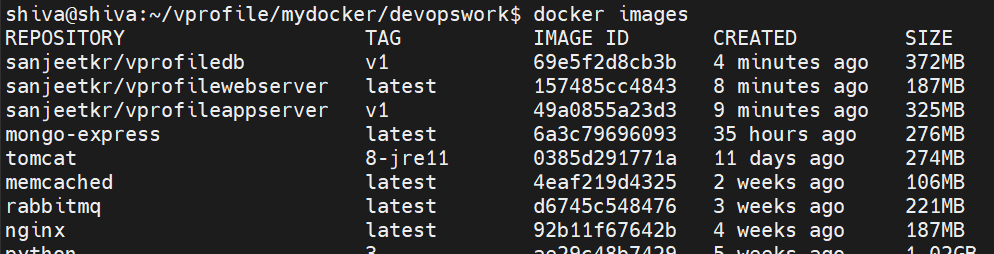

## First project -Vprofile
--------------------------------------


| Service_Name | Component      |
|--------------|----------------|
| Web Server   | Nginx          |
| App Server   | Tomcat         |
| Broker/Queue | RabbitMQ       |
| Caching      | Memcache       |
| Indexing     | Elastic Search |


**Prerequisites**

- JDK 1.8 or later: https://www.digitalocean.com/community/tutorials/how-to-install-java-with-apt-on-ubuntu-22-04

- Maven 3 or above: https://www.digitalocean.com/community/tutorials/install-maven-linux-ubuntu

- MYSQL 5.6

**Instruction**
----------------------------------

1- mvn install
2- copy target to appserver/
3- Start building images
    A. docker build -t sanjeetkr/vproject:v1 . => appserver
    B. docker build -t sanjeetkr/db:v1 . => db
    C. docker build -t sanjeetkr/web:v1 . => webserver
    D. docker pull memcached
    E. docker pull rabbitmq

4- 


### Direct Images:

| Image Name   | Version        | PORT |Comments   |
|--------------|----------------|------|-----------|
| mysql |5.7.25 | 3306 | Container name= 'vprodb' with dbname= 'accounts' |
| Tomcat  |        | 8080  |     |
| Memcache |    |  11211   | container name= 'vprocache01' |
| Broker    |    |   15672   |   container name = 'vpromq01'  |
|  elastic search   |     |  9300    |container name= 'vprosearch01'  |


```
    **nginx.conf**

    upstream vproapp {
        server vproapp:8080;
    }

    server {
        listen 80;
    location / {
        proxy_pass http://vproapp;
    }
    }

    This means, it will listen on port 80 and forward to 8080

    Note: container shpuld run with name vproapp in docker
            In kubernetes, service should run with name vproapp
```

**Step_Instructions**
---------------------------------------------------

1> mvn install => to get target folder
2> move the target directory to appserver folder as artifacts will be copied
3> Start building images for appserver, webserver, dbserver, broker , indexing and caching

    ```
        A. vprofileappserver =>  docker build -t sanjeetkr/vprofileappserver:v1 .
        B. vprofilewebserver =>  docker build -t sanjeetkr/vprofilewebserver .
        C. vprofiledb        =>  docker build -t sanjeetkr/vprofiledb:v1 .

        1. docker pull memcached
        2. docker pull rabbitmq
        3. docker pull elasticsearch:7.17.18

    ```
    

4> Write docker-compose
