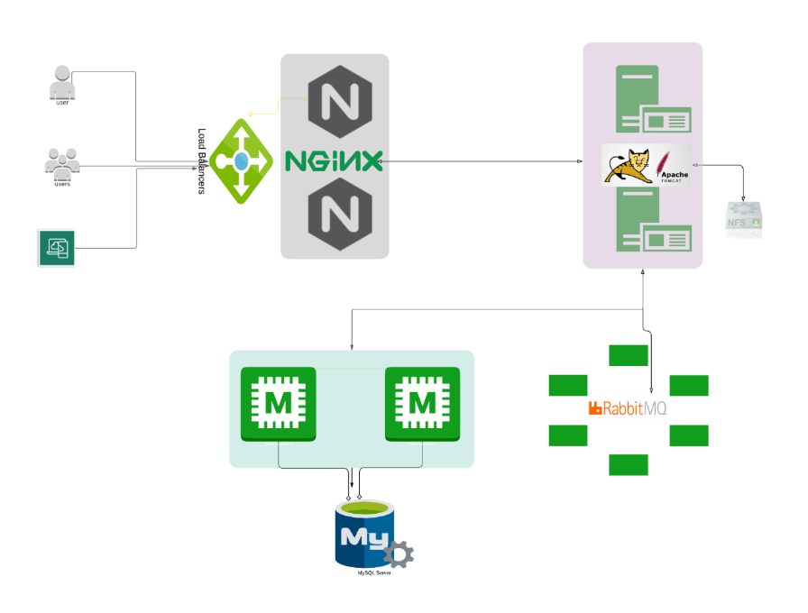
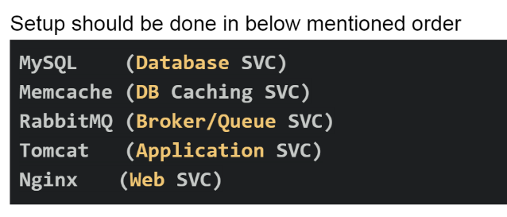

## First project -Vprofile
--------------------------------------



| Service_Name | Component      |
|--------------|----------------|
| Web Server   | Nginx          |
| App Server   | Tomcat         |
| Broker/Queue | RabbitMQ       |
| Caching      | Memcache       |
| Indexing     | Elastic Search |




**Prerequisites**

- JDK 1.8 or later: https://www.digitalocean.com/community/tutorials/how-to-install-java-with-apt-on-ubuntu-22-04

- Maven 3 or above: https://www.digitalocean.com/community/tutorials/install-maven-linux-ubuntu

- MYSQL 5.6

**Instruction**
----------------------------------

1- mvn install

### Direct Images:

| Image Name   | Version        | PORT |Comments   |
|--------------|----------------|------|-----------|
| mysql |5.7.25 | 3306 | Container name= 'vprodb' with dbname= 'accounts' |
| Tomcat  |        | 8080  |     |
| Memcache |    |  11211   | container name= 'vprocache01' |
| Broker    |    |   15672   |   container name = 'vpromq01'  |
|  elastic search   |     |  9300    |container name= 'vprosearch01'  |


```
    **nginx.conf**

    upstream vproapp {
        server vproapp:8080;
    }

    server {
        listen 80;
    location / {
        proxy_pass http://vproapp;
    }
    }

    This means, it will listen on port 80 and forward to 8080

    Note: container shpuld run with name vproapp in docker
            In kubernetes, service should run with name vproapp
```